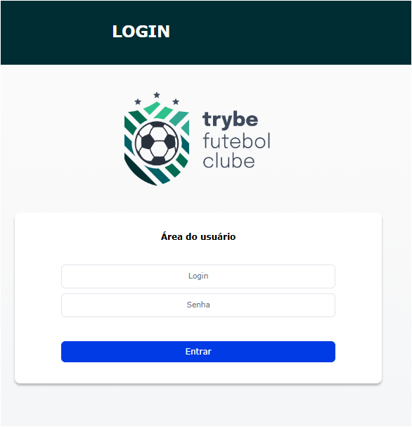
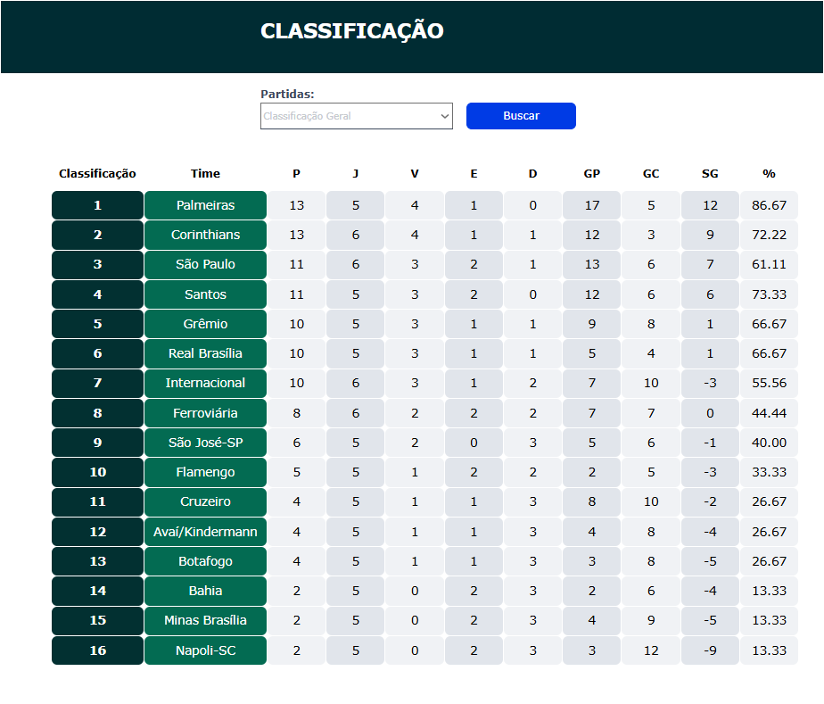

# TFC - Futebol Clube

## 📋 Sobre o Projeto
O TFC Futebol Clube é uma aplicação full-stack que simula um sistema de gerenciamento de futebol, permitindo visualizar partidas, times e estatísticas. A aplicação foi desenvolvida como parte do curso de Desenvolvimento Web Trybe.





## 🚀 Funcionalidades
- Visualização de partidas em andamento
- Histórico de partidas
- Gerenciamento de times
- Sistema de autenticação
- Visualização de estatísticas
- Interface responsiva


## 🛠️ Tecnologias Utilizadas
### Backend
- Node.js (v16.14.0 LTS)
- TypeScript
- Express.js
- Sequelize (ORM)
  - Migrations
  - Models
  - Associations 1:N e N:N
- MySQL
- JWT para autenticação
- Bcrypt para criptografia

### Frontend
- React.js
- React Router DOM
- Axios para requisições HTTP
- CSS para estilização

### Infraestrutura
- Docker (com Dockerfile configurado)
- Docker Compose (v1.29.2)
- Git para versionamento

## 🔧 Como Executar o Projeto

### Requisitos do Sistema
- Node.js v16.14.0 LTS
- Docker v20.10.x
- Docker Compose v1.29.2 ou superior

### Configuração do Banco de Dados
O projeto utiliza MySQL através do Docker, com as configurações padrão de desenvolvimento:
- Porta: 3002
- Database: TRYBE_FUTEBOL_CLUBE
- Configurações adicionais são gerenciadas automaticamente pelo Docker

### Instalação

1. Clone o repositório:
```bash
git clone https://github.com/JaySant/project-trybe-futebol-clube.git
cd trybe-futebol-clube
```

2. Inicie os containers Docker:
```bash
cd app
docker-compose up -d
```

3. Acesse o banco de dados MySQL:
```bash
docker exec -it db mysql -u root -p123456
```

4. O frontend estará disponível em: http://localhost:3000
5. O backend estará disponível em: http://localhost:3001

### Comandos Úteis

- Para iniciar a aplicação:

```bash
# Instalar dependências
npm run postinstall

# Iniciar a aplicação com Docker
npm run compose:up:dev

# Parar a aplicação
docker-compose down

# Visualizar logs
docker-compose logs -f
```

- Para resetar o banco de dados:
```bash
cd app/backend
npm run db:reset
```

## 📁 Estrutura do Projeto
```
app/
├── backend/           # API REST com Node.js e TypeScript
│   ├── src/           # Código fonte do backend
│   └── tests/         # Testes do backend
├── frontend/          # Interface React.js
│   ├── src/           # Código fonte do frontend
│   └── public/        # Arquivos estáticos
└── docker-compose.yml # Configuração dos containers
```

## 📝 Licença
Este projeto está sob a licença MIT. Veja o arquivo [LICENSE](LICENSE) para mais detalhes.

## 👨‍💻 Desenvolvedor
- [JaySant](https://github.com/JaySant)
